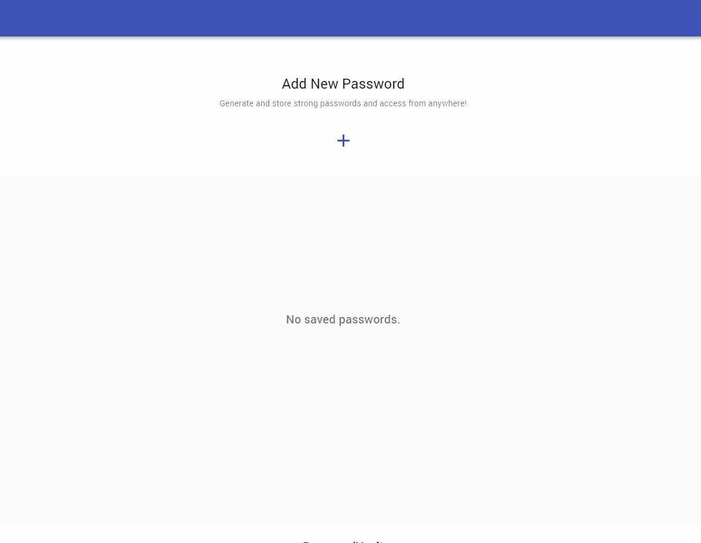

# PasswordKeeper

> PasswordKeeper is a free password generator/manager tool build with React allows you to create and store random strong passwords and access from anywhere!

<p align="center">
  
</p>

Optionally, you can store your generated passwords to cloud [Firebase](https://console.firebase.google.com/) database. All passwords will be hashed using [cryptoJS](https://www.npmjs.com/package/crypto-js) as a second layer of protecion, but you still can retrieve them when you need.

You will need to sign-in with your Google account using [Firebase Authentication](https://firebase.google.com/docs/auth) and then, all the stored passwords will be bounded to this account.

> Please note that it's always recommended that you shouldn't use any online service to generate passwords for highly sensitive information.

### How to have your own version?

- Download or clone the repo:

```
https://github.com/awran5/PasswordKeeper.git
```

- Create a new [firebase](https://console.firebase.google.com/) project or use your existing one and enable **Cloud Firestore** database, as well as **Google authentication**
- Create a new `.env.local` file inside the main app folder and copy/paste your firebase project **Configuration**

```bash
  REACT_APP_FIREBASE_API_KEY = xxxxxxxxxxxxxxxxxxxxxx
  REACT_APP_FIREBASE_AUTH_DOMAIN = xxxxxxxxxxxxxxxxxxxxxx
  REACT_APP_FIREBASE_DATABASE_URL = xxxxxxxxxxxxxxxxxxxxxx
  REACT_APP_FIREBASE_PROJECT_ID = xxxxxxxxxxxxxxxxxxxxxx
  REACT_APP_FIREBASE_STORAGE_BUCKET = xxxxxxxxxxxxxxxxxxxxxx
  REACT_APP_FIREBASE_MESSAGING_SENDER_ID = xxxxxxxxxxxxxxxxxxxxxx
  REACT_APP_FIREBASE_APP_ID = xxxxxxxxxxxxxxxxxxxxxx
```

### [Website](https://passwordkeeper.vercel.app/)
